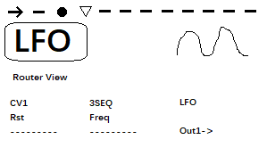

## Manifold集成式调制器 手册

##### 软件版本 v1.00 文档更新日期 2025-09-01

## 一、模块操作与接口详解

#### Manifold的操作逻辑基于12个并列的调制器与对应的参数，您可以自由路由这些模块之间的调制关系以及输入输出接口。

<figure>

    <figcaption>模块示意图</figcaption>
</figure>

### 1. <>

**直接旋转**：用于切换模块，一共包含十二个模块，您可以根据标题下方的指示器来了解当前处于的模块序号。有些模块一开始是空模块，需要您指定他的类型(请见p3说明)

**单击**：用于切换路由模式和参数模式。在这两个模式中，p1/p2/p3都有不同的作用

**两次连按**：用于进入预设列表，您可以在这个列表中进行预设的保存与读取，也可以进行初始化。

### 2. p1/in1  

该旋钮在不同的界面有不同的作用，通常用于修改屏幕左下方对应的参数

### 3. p2/in2  

该旋钮在不同的界面有不同的作用，通常用于修改屏幕中下方对应的参数

### 4. p3/Out  

该旋钮在不同的界面有不同的作用，通常用于修改屏幕右下方对应的参数

### 5. Gate1-3  

用于接受高低电平的接口。您可以在路由界面指定由该接口输入，输入范围为0-10v。在程序中，高低电平检测的阈值通常是2.5v左右。

### 6. CV1-3  

用于接受控制电压的接口。您可以在路由界面指定由该接口输入，输入范围为0-10v。在程序中，0-10v的电平通常被转化成0-4095之中的任意值。您也可以用这个接口来触发Gate接口对应的逻辑，那么检测阈值同样也是2.5v左右

### 7. Out1-6  

用于输出控制电压的接口。您可以在路由界面指定由该接口输出，输出范围为0-10v。在程序中，0-4095之间的任意值最终被转化成0-10v的控制电平，并经由该接口输出。该接口左上方包含一个led指示灯，用于提示输出的电平。

### 8. 顶部标题    

用于展示您当前的模块的名称，在Manifold模块中，任何模块都被抽象成了2个输入，1个输出，3个旋钮控制的虚拟模块。路由界面和参数界面就是对这6个内容进行调整。

### 9. 下标指示器    

用于展示您当前的模块的序号

### 10. 矩阵展示    

用于展示您当前的模块的图像信息，在有的模块，它可以具象展示一些输出波形或者控制内容 

<figure>
    
    <figcaption>模块屏幕主界面</figcaption>
</figure>

### 11. Router View   

当您通过单击<>旋钮并且处于路由界面时，左下方，中下方，右下方将分别展示当前模块in1链接的接口，in2链接的接口，out输出的接口，并且以第二行文字的形式来告知您该接口在模块上的作用。
如果未链接任何接口，则展示"---"，如果您想修改链接的接口，请按下p1/p2并且同时旋转p1/p2，您就可以修改in1/in2所链接的路由。
您会看到：1-12个模块的输出，gate1-3以及cv1-3的名称，表明这些接口被路由到该模块的in1/in2上了。
同时，任何输入输出接口都是带有衰减器的，您可以直接旋转p1/p2来调整衰减的大小，参数下方有一个衰减程度提示器，用于标明衰减程度。
p3旋钮则用来修改当前模块的类型，您需要单击p3，屏幕此时会高亮起p3对应的类型，此时旋转p3，您可以修改当前模块的类型。
当您再次单击p3时，屏幕此时会高亮起p3的输出接口路由，您可以修改当前模块的输出路由。
最后再次点击p3时，p3将循环回到初始状态，此时它不修改任何参数，以防止您可能误旋转导致模块被轻易改变类型或者改变输出路由。

### 12. Param View

当您通过单击<>旋钮并且处于参数界面时，左下方，中下方，右下方将分别展示当前模块参数1，参数2，参数3，并且以第二行文字的形式来告知您该接口在模块上的作用。
此时如果您直接旋转p1/p2/p3，将直接以较快的方式调整三个参数；由于要兼顾调整速度以及精度，如果您需要较为精确的调整对应的参数，需要您按下p1/p2/p3并且旋转。

### 13. Preset View

当您通过双击<>旋钮并且处于预设界面时，您可以通过其他旋钮的按下或旋转来触发预设界面下方的对应功能，包含预设的选择、保存和读取。

## 二、各个模块功能详解

#### 您可以随时通过<>旋钮切换多个模块，当您处于某个模块之下，您可以查阅以下文档用于了解参数以及调制内容。

### 1.LFO低频振荡器

#### 路由设置

**CLK** ：该接口将接受高电平以同步/复位低频振荡器的相位

**CV** ：该接口将接受电平数值以控制振荡器的频率

#### 参数设置

**Freq**：调整低频振荡器的频率，范围0.1hz-20hz

**Sync**：是否同步

**Type**：波形类型

### 1.EG包络发生器

#### 路由设置

**Trig** ：该接口将接受高电平以触发包络的执行

**CV** ：该接口将接受电平数值以控制包络的衰减以及释放

#### 参数设置

**Attk**：调整包络的启动时间1ms-2s

**Sustain**：当包络处于触发状态时，保持的电平百分比，0-100%

**Dec/Rel**：释放的时间

(更多模块说明敬请期待)

## 四、技术指标

### 1.尺寸信息

128.5mm x 40.64mm

Eurorack宽度8HP

深度约24mm

### 2.运行信息

使用10pin电源插头

含有防反接电路

+12v 140ma

-12v 10ma

*注意! USB接口上电也可以使模块开机，但是无法正常输出Eurorack标准的电平，同时也无法接收CV输入!

### 3.运行平台

Pico RP2040

### 4.电压输出技术指标

8khz 12bit 输出电平范围:0-10V 

### 5.控制电压输入技术指标

8khz 12bit 输入电平范围:0-10V

### 6.扩展设备 I2C扩展器

敬请期待

