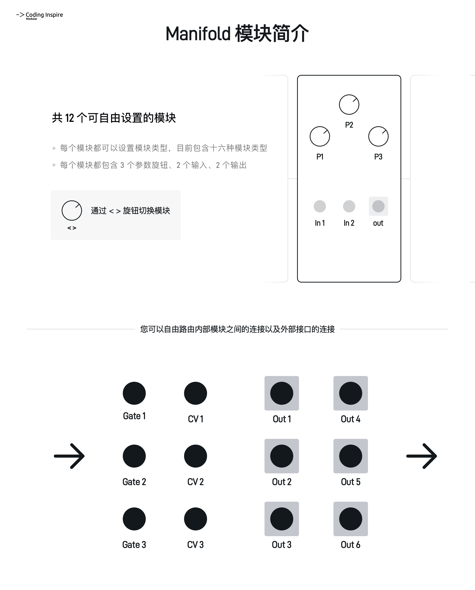

## Manifold集成式数字调制器 用户手册

##### 软件版本 v1.00 文档更新日期 2025-09-01
##### 软件版本 v1.00 文档更新日期 2025-11-18

## 一、快速入门

##### Manifold的操作逻辑基于12个并列的内部调制模块与对应的参数；  
##### 您可以自由路由这些内部模块之间的调制关系以及输入输出接口；  
##### 每个内部模块包含三个参数，两个输入，一个输出。
 

<figure>

    <figcaption>模块简介</figcaption>
</figure>

<figure>

    <figcaption>模块操作概述</figcaption>
</figure>

## 二、模块操作与接口详解

<figure>

    <figcaption>模块示意图</figcaption>
</figure>

### 1. <> 旋钮  

**直接旋转**：用于切换模块，一共包含十二个模块，您可以根据顶部的指示器(请见8. 指示器 说明)来了解当前处于的模块位置。有些模块一开始是空模块，需要您指定他的类型(请见 11. 屏幕-Router View 说明)

**单击**：用于切换路由界面(Router View)和参数界面(Param View)。在这两个界面中，P1/P2/P3都有不同的作用，他们通常可以对应修改屏幕下方三处的信息

**两次连按**：用于进入预设界面(Preset)，您可以在这个界面的列表中进行预设的保存与读取，也可以进行初始化，以及随机生成预设(请见13. 预设界面说明)。

### 2. P1/In1 旋钮  

该旋钮/按钮在不同的界面有不同的作用，通常用于修改屏幕左下方对应的参数，在路由界面下，您还可以通过单击之后，再进行修改。在参数界面下，您可以按下同时旋转来精确调整参数。

### 3. P2/In2 旋钮  

该旋钮/按钮在不同的界面有不同的作用，通常用于修改屏幕中下方对应的参数，在路由界面下，您还可以通过单击之后，再进行修改。在参数界面下，您可以按下同时旋转来精确调整参数。

### 4. P3/Out 旋钮  

该旋钮/按钮在不同的界面有不同的作用，通常用于修改屏幕右下方对应的参数，在路由界面下，您还可以通过单击之后，再进行修改。在参数界面下，您可以按下同时旋转来精确调整参数。

### 5. Gate1-3 输入接口  

用于接受高低电平的接口。您可以在路由界面指定由该接口输入，输入范围为0-10v。  
在程序中，高低电平会被转化成0和4095，没有中间值。

### 6. CV1-3 输入接口  

用于接受控制电压的接口。您可以在路由界面指定由该接口输入，输入范围为0-10v。在程序中，0-10v的电平通常被转化成0-4095之中的任意值。  
您也可以用这个接口来触发Gate接口对应的逻辑，那么检测阈值同样也是2.5v左右

### 7. Out1-6 输出接口  

用于输出控制电压的接口。您可以在路由界面指定由该接口输出，输出范围为0-10v。在程序中，0-4095之间的任意值最终被转化成0-10v的控制电平，并经由该接口输出。  
每个输出接口左上方包含一个Led指示灯，用于提示输出的电平。在Manifold的程序中，Gate输出与CV输出都被视为0-4095的数值，因此它们都可以使用这些接口输出。  

<figure>
    
    <figcaption>模块屏幕主界面</figcaption>
</figure>

### 8. 屏幕-下标指示器    

用于展示您当前的模块处于的位置，以及简略查看模块的状态。十二个图标对应十二个模块，每个模块的图标包含四种形状以对应不同的状态：  
1.当图标处于倒三角时，表示您当前调整的模块在十二个模块中的位置；  
2.当图标显示一条横线时，表示这里还没有设置模块，为空模块；  
3.当图标显示一个向右的箭头时，表示该模块为输出模块，它被指定到了Out1-6的接口上进行输出信号；  
4.当图标显示一个实心圆点时，表示该模块已经被创建，但是仅作为内部调制使用，没有指定到输出接口；  

### 9. 屏幕-左上方标题    

用于展示您当前的模块的名称，在Manifold模块中，任何模块都被抽象成了2个输入，1个输出，3个旋钮控制的虚拟模块。路由界面和参数界面就是对当前模块的这6个内容进行调整。

### 10. 屏幕-矩阵展示    

用于展示您当前的模块的图像信息，在有的模块，它可以具象展示一些输出波形或者控制内容，有的模块则直接展示诸如推子/音符等动画效果。    

### 11. 屏幕-Router View 路由界面   

#### 基本逻辑
由于内部包含十二个模块，每个模块并没有直接相连，需要您在此界面进行模块虚拟跳线的路由，因此它们的顺序无关紧要。  
当您通过单击<>旋钮并且处于路由界面时，左下方，中下方，右下方将分别展示当前模块In1链接的接口，In2链接的接口，out输出的接口，并且以第二行文字的形式来告知您该接口在模块上的作用。  
对于左下方参数和中下方参数(对应P1和P2旋钮):   
  
#### 设置当前模块的输入路由
观察左下方/中下方的两个参数，每个参数的第一行文字代表当前模块的输入接口路由到了何处，如果未链接任何接口，则展示"---"，  
每个参数第二行文字表示该接口调制模块内的什么参数，这在不同模块下，调制的参数各不相同，您可以查阅第二章对于模块接口的说明。  
如果您想修改链接的接口，请按下P1/P2，您会看到下方的标题亮起，然后旋转P1/P2旋钮，您就可以修改In1/In2所链接的路由。  
路由列表中您会看到：1-12个模块的名称(通常为模块序号+模块名称，举例：7LOGIC，则表示第七个叫做逻辑的模块被路由到了这个输入接口上)，  
gate1-3以及cv1-3的名称，表明这些接口被路由到该模块的In1/In2上了。  
最后，当您再次按下P1/P2，则标题会从亮起状态恢复至熄灭状态，表示您已经退出输入路由设置了。
  
#### 设置当前模块输入的衰减程度
同时，任何输入接口都是带有衰减器的，您可以在左下方/中下方两个参数未被点亮时，直接旋转P1/P2来调整衰减的大小；  
或者当您处于修改路由、标题高亮的情况下，请再按一次对应的P1/P2旋钮，便可回到衰减修改的状态。  
参数下方有一个衰减程度提示器，用于标明衰减程度。  

#### 设置当前模块的类型
对于右下方参数(对应P3旋钮)  
P3旋钮则用来修改当前模块的类型，您需要单击P3，屏幕此时会高亮起P3对应的类型，此时旋转P3，您可以修改当前模块的类型。  
当您修改完模块的类型，或者不修改类型而直接再次单击P3，将进入输出路由设置。

#### 设置当前模块的输出路由
当您处于设置模块类型的状态下，再次单击P3时，屏幕此时会高亮起P3的输出接口路由，您可以修改当前模块的输出路由。  
在输出路由的选择中，您会看到Out1-6的接口以及---的提示。当显示---时，表示该模块并不输出到物理输出接口之上，仅作为内部调制使用。  
为了方便使用，我们已将第1/3/5/7/9/11的模块默认映射到Out1/Out2/Out3/Out4/Out5/Out6之上。    
当某个Out接口已经被使用了，您将在这个选择中无法再次使用这个输出接口，因为输出接口是一对一的。  
如果您需要使用一个已经被占用的接口，则需要寻找到那个占用该接口的模块，并且使之选择到---或者其他接口之上，以解除占用。  

#### 回到P3旋钮初始状态
最后再次点击P3时，P3将循环回到初始状态，此时它不修改任何参数，以防止您可能误旋转导致模块被轻易改变类型或者改变输出路由的。  

### 12. 屏幕-Param View 参数界面  

当您通过单击<>旋钮并且处于参数界面时，左下方，中下方，右下方将分别展示当前模块参数1，参数2，参数3，
每个参数第一行文字表示该接口调制模块内的什么参数，这在不同模块下，对应的参数各不相同，您可以查阅第二章对于每种类型模块参数的说明。  
每个参数第二行文字表示该参数当前的状态，用于您快速了解模块的相关状态。   
此时如果您直接旋转P1/P2/P3，将直接调整对应的三个参数；  
由于要兼顾调整速度以及精度，如果您需要较为快速的调整对应的参数，需要您按下P1/P2/P3同时旋转，便可较为快速的调整对应参数。

### 13. 屏幕-Preset View 预设界面  

当您通过双击<>旋钮并且处于预设界面时，您可以通过其他旋钮的按下或旋转来触发预设界面下方的对应功能，包含预设的选择、保存和读取。  

#### 预设存储
模块包含十六个存储位置，每一个存储位置都将保存十二个模块的参数与路由状态。  

#### 初始化
预设界面包含Init Preset功能，位于列表中16个预设的上方，您可以通过选择这个来初始化模块参数。  

#### 随机生成预设(实验室)
预设界面包含Preset Gen随机生成功能位于Init Preset的上方，这个功能将随机产生十二组任意类型的模块，同时，随机任意路由他们的关系，以便您可以借此尝试一些灵感实验。  

#### 工厂预设
预设界面包含一系列工厂预设，位于16个预设的下方，您可以直接调用艺术家预设，以及一些常用的功能，方便您快速进入一些特定的调制场景。敬请期待更多的工厂预设。  

<figure>

    <figcaption>模块工作流说明</figcaption>
</figure>

## 三、各个模块功能详解

#### 您可以随时通过<>旋钮切换多个模块，当您处于某个模块之下，您可以查阅以下文档用于了解参数以及调制内容。

### 1.LFO低频振荡器

#### 该模块是一个基础的低频振荡器，震荡范围0.1-20hz，有五种波形可以选择

#### 路由设置

**RST** ：该接口将接受高电平以同步/复位低频振荡器的相位

**Freq** ：该接口将接受电平数值以控制振荡器的频率

#### 参数设置

**Freq**：调整低频振荡器的频率，范围0.1hz-20hz

**Phase**：相位0-360度，当复位时，从该相位开始震荡

**Type**：波形类型，包含正弦波、三角波、方波、下降锯齿波、上升锯齿波

### 2.EG包络发生器

#### 该模块是一个传统的包络发生器，但是可以压控Decay与Release

#### 路由设置

**Trig** ：该接口将接受上升沿以触发包络的执行

**CV** ：该接口将接受电平数值以控制包络的衰减以及释放

#### 参数设置

**Attk**：调整包络的启动时间1ms-2s

**Sustain**：当包络处于触发状态时，保持的电平百分比，0-100%

**Dec/Rel**：释放的时间

### 3.CLKDIV时钟分频器

#### 该模块为时钟分频器，您可以选择使用1-16之间的任意分频数值，也可以使用2的n次方数值分屏

#### 路由设置

**CLK** ：该接口将接受上升沿以触发时钟分频器

**RST** ：该接口将接受上升沿以触发复位

#### 参数设置

**---**：调整包络的启动时间1ms-2s

**Mode**：用于设置分频数值的模式，分为0-16的任意值以及2的n次方

**Divide**：分频数值，分为0-16的任意值以及2的n次方

### 4.Logic逻辑

#### 该模块包含四种逻辑触发功能

#### 路由设置

**In1** ：任意输入，但是在逻辑判断中以2.5v以上为True，以下为False进行逻辑判断

**In2** ：任意输入，但是在逻辑判断中以2.5v以上为True，以下为False进行逻辑判断

#### 参数设置

**---**：

**---**：

**Type**：四种模式  
AND: 当二者皆为True才输出True  
OR： 当二者有其一为True就输出True  
NOT：仅对In1进行判断，当In1为True则输出False，当In1为False则输出True  
YES：仅对In1进行判断，当In1为True则输出True，当In1为False则输出False  

### 5.SNH(S&H)采样保持

#### 该模块为采样保持模块，通过Trig信号来获取此刻的电平值，然后输出此电平值直到下一次Trig的重新触发；并且整合了平滑器以及突变器。

#### 路由设置

**Trig** ：该接口将接受上升沿以触发对Sign电压的采样 当SNH(Param1)处于Off的时候，该信号不起任何作用

**Sign** ：该接口将接受电压

#### 参数设置

**SNH**：On:开启采样保持 将根据In2的上升沿信号来保持In1的输入信号 Off:关闭采样保持 将In1的信号直接获取

**Smooth**： 平滑程度，当有值时，平滑采样保持或者In1的信号，当为0时不做任何平滑

**Jitter**： 激变程度，当有值时，激变经过Smooth处理或不处理的信号，当为0时则不做任何激变

### 6.RNDOM概率

#### 该模块是一个随机模块，它可以做概率触发，随机电平，随机故障方波，随机噪音，每种模式都可以控制程度

#### 路由设置

**Trig** ：该接口将接受电压上升沿以及下降沿

**---** ：

#### 参数设置

**Prob/Amt**：Prob:概率，Amt:变化程度

**---**：

**Mode**：四种模式：  
1.Gate，当检测到上升沿时根据Prob的参数来确定触发几率，触发成功则输出高电平；当检测到下降沿时，则立刻低电平输出  
2.RndCV，当检测到上升沿时，则随机输出一个电平，并且在下一次触发之前持续保持这个电平的输出。而此时Amt参数则表示这个电平变化的剧烈程度  
3.Bin， 当检测到上升沿时，则随机触发一个0.1-16hz的震荡波输出，并且在下一次触发之前持续保持这个频率的输出，而此时Amt参数则表示这个频率变化的剧烈程度  
4.Noise，不检测任何输入，持续输出随机值，而此时Amt参数则表示这个随机值变化的剧烈程度  

### 7.SEQ生成式CV音序

#### 该模块是一个生成式CV音序，他将根据最大电平/最小电平/步进长度来生成一段音序，每当您改变范围参数，都会重新触发生成

#### 路由设置

**CLK** ：当检测到大于2.5v的上升沿时，音序器将进行下一步

**RST** ：当检测到大于2.5v的上升沿时，音序器使播放头进度复位

#### 参数设置

**Min RG**：生成CV音序的最低电平

**Max RG**：生成CV音序的最高电平

**Steps**：生成音序的总步长，设置范围1-16

### 8.Eucld欧几里得音序

#### 该模块是一个欧几里得音序

#### 路由设置

**CLK** ：当检测到大于2.5v的上升沿时，音序器将进行下一步，当检测到下降沿时，输出接口将回到低电平，因此您可以通过调整时钟的长短来间接使欧几里得音序输出长Gate还是较短的Trig

**RST** ：当检测到大于2.5v的上升沿时，音序器使播放头进度复位

#### 参数设置

**Shift**：欧几里得音序中的偏移

**Steps**：欧几里得音序的总步长，设置范围1-16

**Active**：欧几里得音序中触发的步进总数

### 9.ARP琶音器

#### 该模块是一个琶音器模块

#### 路由设置

**Trig** ：当检测到大于2.5v的上升沿时，进行一次琶音输出

**VOCT** ：检测VOCT信号，使琶音和弦以之为根音

#### 参数设置

**Chord**：琶音和弦类型

**Mode**：琶音模式，包含四种模式，UP Down UP&Down Random

**Oct**：八度 1-4个八度

### 10.Beati 比特节奏音序

#### (实验功能)该模块通过P1和P3两个参数通过二进制位生成一段节奏，您也可以设置步长

#### 路由设置

**CLK** ：当检测到大于2.5v的上升沿时，音序器将进行下一步，当检测到下降沿时，输出接口将回到低电平，因此您可以通过调整时钟的长短来间接使欧几里得音序输出长Gate还是较短的Trig

**RST** ：当检测到大于2.5v的上升沿时，音序器使播放头进度复位

#### 参数设置

**P1**：生成节奏音序的参数1

**Steps**：节奏音序的总步长，设置范围1-16

**P3**：生成节奏音序的参数2

### 11.MIX混合

#### 该模块可以使两个输入信号进行混合，您可以控制每个输入的增益以及输出的增益

#### 路由设置

**In1** ：需要混合的信号1

**In2** ：需要混合的信号2

#### 参数设置

**Gain1**：对信号1的增益0-2倍

**Gain2**：对信号2的增益0-2倍

**Master**：对最终输出信号的增益调整

### 12.FADER比例推子

#### 该模块可以使两个输入信号进行过度渐变，以创造特定的调制效果

#### 路由设置

**In1** ：需要混合的信号1

**In2** ：需要混合的信号2

#### 参数设置

**Gain1**：对信号1的增益

**Cross**：对信号1与信号2的交叉程度

**Gain2**：对信号2的增益

### 13.VCA压控放大器

#### 该模块是一个压控放大器模块，通常您可以用它来处理cv之间的关系

#### 路由设置

**CV** ：压控放大器的压控输入

**In** ：被压控的信号输入

#### 参数设置

**Offset**：对压控输入的偏置程度

**Atten**：对压控输入的衰减程度

**---**：

### 14.Invert信号反向器

#### 该模块使输入信号指定为对应的0-4095数值，然后根据Amt旋钮来反转信号数值

#### 路由设置

**Sign** ：需要反向的信号输入

**---** ：

#### 参数设置

**Amt**：对输入信号的反向程度

**---**：

**---**：

### 15.Qunt量化器

#### 该模块使输入信号量化成为指定的音阶，您还可以指定音阶的根音，以及最终输出的音高偏置

#### 路由设置

**Trig** ：对信号触发量化

**Sign** ：输入需要量化的信号

#### 参数设置

**Root**：设置量化音阶的根音

**Scale**：设置量化的音阶类型，包含十二种音阶

**Offset**：对最终输出的音高做一个半音偏置 +-12个半音

### 16.OVERFL堆栈溢出

#### 该模块适合用于制作故障效果。使输入信号根据程序内存大小切割成多个子信号，您可以使用一个上升的斜率信号，便可以得到多个连续上升的信号，同理，下降信号也是一样

#### 路由设置

**Sign** ：输入信号

**CV** ： 压控堆大小 将与参数中的堆大小进行相加 数值越大 堆栈越小 溢出效果越大

#### 参数设置

**Heap**：堆大小 数值越大 堆栈越小 溢出效果越大

**Mode**： 模式：2^N-2的N次方堆大小，最大2048; Free-1-4095的任意值堆大小

**---**：

(更多模块敬请期待)

## 四、技术指标

### 1.尺寸信息

128.5mm x 40.64mm

Eurorack宽度8HP

深度约24mm

### 2.运行信息

使用10pin电源插头

含有防反接电路

+12v 100ma

-12v 10ma

*注意! USB接口上电也可以使模块开机，但是无法正常输出Eurorack标准的电平，同时也无法接收CV输入!

### 3.运行平台

Pico RP2040

### 4.电压输出技术指标

8khz 12bit 输出电平范围:0-10V 

### 5.控制电压输入技术指标

8khz 12bit 输入电平范围:0-10V

### 6.扩展设备 I2C扩展器

敬请期待

## 五、固件升级

请在usb连接您的计算机之前按住Pico RP2040的Boot键，然后连接usb与计算机，此时您会在您的计算机中发现一个新的磁盘，此时将下载好的UF2固件文件拖入其中，等待一分钟后，移除usb，您的Manifold模块就已经升级完成
