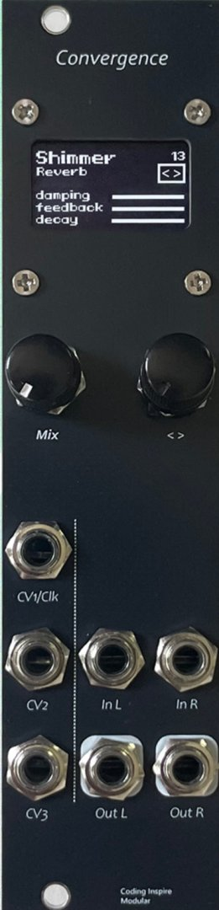
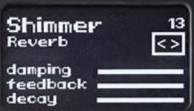

<H1>Convergence 数字效果处理器 用户手册</H1>

软件版本 v2.0 文档更新日期 2026-07-01

## 一、产品概述

Convergence 是一款高性能 Eurorack 格式数字效果处理器模块，集成了 23 种精心设计的音频效果，涵盖调制、延迟和混响三大类。模块采用 DSP 数字信号处理器芯片，提供专业级的音频处理能力。

### 效果分类

| 组别 | 效果类型 | 效果数量 |
|------|----------|----------|
| PRESET | 调制/基础效果 | 7 |
| REVERB | 混响效果 | 8 |
| DELAY | 延迟效果 | 8 |

## 二、操作说明

### 实物图

### 1. 硬件控制

#### Mix 旋钮

用于控制效果的干湿混合比例（Dry/Wet）。顺时针旋转增加效果信号比例，逆时针旋转增加原始信号比例。

#### < > 旋钮

该旋钮具有旋转和按下两种操作方式：

**旋转**：根据当前编辑状态，修改效果类型或效果参数。

**短按**：切换旋钮的修改状态，循环切换：浏览模式 → 参数1 → 参数2 → 参数3 → 浏览模式。

**长按**：在参数编辑模式下，长按旋钮的同时旋转，可以精细调节当前参数值。

**编辑模式说明：**

- **浏览模式**：旋转旋钮切换效果类型，< >图标周围会出现光标框表示当前处于此模式
- **参数1模式**：旋转旋钮调整参数1的值，参数1行出现光标框
- **参数2模式**：旋转旋钮调整参数2的值，参数2行出现光标框
- **参数3模式**：旋转旋钮调整参数3的值，参数3行出现光标框

### 2. 接口说明

**CV1/CLK**：参数1的压控接口；当参数为clk时，可以输入时钟信号用于同步延迟时间。支持x1-x7倍率。

**CV2**：参数2的压控接口。调制范围为0-5v，超过的5v的电压会自动被截断。

**CV3**：参数3的压控接口。调制范围为0-5v，超过的5v的电压会自动被截断。

**InL**：左声道输入。

**InR**：右声道输入；当右声道不接入输入时，将自动复制左声道的输入信号到右声道。

**OutL**：左声道输出。

**OutR**：右声道输出。

**CV控制特性**：CV信号与旋钮值叠加后传递给效果器，即 `CV值 + 旋钮值 = 最终参数值`。

### 3. UI界面说明

OLED显示屏的布局如下：

**大标题（顶部）**：当前效果的名称，如 Shimmer、Plate、Delay 等。

**小标题（大标题下方）**：效果分类，如 reverb、modulation、delay 等。

**右上角**：当前效果编号（0-23）。

**< > 图标**：表示旋钮操作状态，当光标框处于此图标时，表示处于浏览模式，旋钮用于切换效果。

**参数1-3**：显示三个可调节参数的名称，右侧显示参数值进度条或时钟同步信息。

**光标指示：**

- 当光标框处于 `< >` 时：旋钮旋转用于切换效果类型
- 当光标框处于某一参数行时：旋钮旋转用于修改该参数的值

**时钟同步显示：**

## 三、效果详解

### 1. Chorus 合唱

**调制效果，通过多个延迟信号与原信号混合产生丰富的和声效果**

| 参数 | 功能 | 说明 |
|------|------|------|
| P1 - Reverb | 混响深度 | 控制合唱效果中混响的强度 |
| P2 - Rate | 调制速率 | 控制合唱的LFO调制频率 |
| P3 - Mix | 干湿混合 | 控制原始信号与效果信号的混合比例 |

### 2. Flanger 镶边

**调制效果，通过短延迟信号与原信号叠加产生梳状滤波效果**

| 参数 | 功能 | 说明 |
|------|------|------|
| P1 - Reverb | 混响深度 | 控制镶边效果中的混响成分 |
| P2 - Rate | 调制速率 | 控制延迟时间的调制频率 |
| P3 - Mix | 干湿混合 | 控制原始信号与效果信号的混合比例 |

### 3. Tremolo 颤音

**调制效果，通过周期性改变音量产生脉动效果**

| 参数 | 功能 | 说明 |
|------|------|------|
| P1 - Reverb | 混响深度 | 控制颤音效果中的混响成分 |
| P2 - Rate | 调制速率 | 控制音量变化的频率 |
| P3 - Mix | 干湿混合 | 控制原始信号与效果信号的混合比例 |

### 4. Tune 音调偏移

**移调效果，改变输入信号的音调**

| 参数 | 功能 | 说明 |
|------|------|------|
| P1 - Tune | 音调偏移量 | 控制音调的升降幅度 |
| P2 - --- | 无 | --- |
| P3 - --- | 无 | --- |

### 5. Tune Dly 音调延迟

**结合音调偏移与延迟效果**

| 参数 | 功能 | 说明 |
|------|------|------|
| P1 - Tune | 音调偏移量 | 控制延迟信号的音调偏移 |
| P2 - Delay | 延迟时间 | 控制延迟的时间长度 |
| P3 - Mix | 干湿混合 | 控制原始信号与效果信号的混合比例 |

### 6. By Pass 直通

**无效果处理，信号直接通过**

| 参数 | 功能 | 说明 |
|------|------|------|
| P1 - --- | 无 | --- |
| P2 - --- | 无 | --- |
| P3 - --- | 无 | --- |

### 7. ReverbI 混响 I

**基础混响效果**

| 参数 | 功能 | 说明 |
|------|------|------|
| P1 - Time | 混响时间 | 控制混响的衰减时间 |
| P2 - HF Loss | 高频损失 | 控制混响中的高频衰减程度 |
| P3 - LF Loss | 低频损失 | 控制混响中的低频衰减程度 |

### 8. ReverbII 混响 II

**高级混响效果，提供更丰富的空间感**

| 参数 | 功能 | 说明 |
|------|------|------|
| P1 - Time | 混响时间 | 控制混响的衰减时间 |
| P2 - HF Loss | 高频损失 | 控制混响中的高频衰减程度 |
| P3 - LF Loss | 低频损失 | 控制混响中的低频衰减程度 |

---

## 四、混响效果 (REVERB)

### 9. Spring 弹簧混响

**模拟经典弹簧混响效果，带有双磁头磁带延迟**

| 参数 | 功能 | 说明 |
|------|------|------|
| P1 - Time | 延迟时间 | 控制磁带延迟的时间，范围约 60-487ms |
| P2 - Feedback | 反馈量 | 控制延迟反馈强度，影响回声重复次数 |
| P3 - Reverb | 混响电平 | 控制弹簧混响的输出电平 |

**描述**：该效果模拟经典的 RE301 弹簧混响单元，包含两个延迟磁头（Head 2 和 Head 3），带有 Wow & Flutter 效果模拟磁带机的速度波动。

### 10. Plate 板式混响

**基于 Dattorro 算法的板式混响，带有可变频率音调偏移**

| 参数 | 功能 | 说明 |
|------|------|------|
| P1 - Shift | 音调偏移 | 控制输入信号和反馈信号的频率偏移量 |
| P2 - Reverb | 混响时间 | 控制混响衰减时间，最大值接近无限延音 |
| P3 - HF Loss | 高频损失 | 控制混响回路中的高频阻尼 |

**描述**：采用 Jon Dattorro 的 "Effect Design" 论文算法，包含输入扩散网络和双回路混响结构，支持音调偏移产生 Shimmer 效果。

### 11. Reverse 反向混响

**立体声反向混响效果，具有独特的扩散和滤波控制**

| 参数 | 功能 | 说明 |
|------|------|------|
| P1 - Time | 混响时间 | 控制混响的衰减时间，范围 0.2-0.9 |
| P2 - Diffusion | 扩散程度 | 控制输入全通滤波器的扩散系数，范围 0-0.7 |
| P3 - Decay LF | 低频衰减 | 控制混响衰减过程中的低频滤波 |

**描述**：采用单回路结构，通道包含 3 个可变扩散全通滤波器和 1 个固定系数全通滤波器。

### 12. Hall 大厅混响

**大型厅堂混响效果，带有预延迟控制**

| 参数 | 功能 | 说明 |
|------|------|------|
| P1 - Pre-delay | 预延迟时间 | 控制输入信号到混响开始的延迟，范围 0-100ms |
| P2 - Time | 混响时间 | 控制混响衰减时间 |
| P3 - Damping | 阻尼 | 控制高频衰减的低通滤波系数 |

**描述**：包含 100ms 预延迟缓冲区和多层初始延迟结构，通过多个抽头产生丰富的早期反射声。

### 13. Rainbow 彩虹混响

**带有固定1八度音调偏移的 Dattorro 混响**

| 参数 | 功能 | 说明 |
|------|------|------|
| P1 - Shift | 音调偏移电平 | 控制音调偏移信号的混合电平 |
| P2 - Time | 混响时间 | 控制混响衰减时间 |
| P3 - HF Loss | 高频损失 | 控制混响回路中的高频阻尼 |

**描述**：在 Dattorro 混响结构中加入固定 +1 八度的音调偏移，产生类似 Shimmer 的彩虹般音色。

### 14. Shimmer 闪烁混响

**带有反馈音调偏移的大厅混响，创造天使般的音色**

| 参数 | 功能 | 说明 |
|------|------|------|
| P1 - Damping | 阻尼 | 控制混响回路中的高低通滤波混合比例 |
| P2 - Feedback | 反馈量 | 控制音调偏移信号的反馈强度 |
| P3 - Decay | 衰减时间 | 控制混响的衰减时间，范围 0.3-0.95 |

**描述**：将混响输出进行 +1 八度音调偏移后反馈回输入，创造出持续上升的高频泛音效果，常用于氛围音乐制作。

### 15. Space 空间混响

**回声与混响的组合效果，创造深邃的空间感**

| 参数 | 功能 | 说明 |
|------|------|------|
| P1 - Time | 延迟时间 | 控制回声延迟时间，范围 100-700ms |
| P2 - Repeat | 重复次数 | 控制回声的反馈强度和重复次数 |
| P3 - Reverb | 混响电平 | 控制混响效果的输出电平 |

**描述**：结合了 22938 采样点的长延迟和双回路混响结构，回声滤波器系数根据反馈量动态调整。

### 16. Room345 房间混响

**三抽头房间混响，提供紧凑的空间感**

| 参数 | 功能 | 说明 |
|------|------|------|
| P1 - Scale | 缩放 | 控制延迟时间的缩放比例 |
| P2 - Feedback | 反馈量 | 控制三个抽头的反馈强度 |
| P3 - ThreeTap | 三抽头混合 | 控制三个延迟抽头的混合比例 |

**描述**：使用三个不同长度的延迟线（0、5242、11792 采样点）模拟房间的早期反射声。

---

## 五、延迟效果 (DELAY)

### 17. Delay 基础延迟

**经典的模拟风格延迟效果**

| 参数 | 功能 | 说明 |
|------|------|------|
| P1 - clk | 延迟时间 | 控制延迟时间，最大约 840ms |
| P2 - Feedback | 反馈量 | 控制延迟反馈强度 |
| P3 - Mix | 干湿混合 | 控制原始信号与延迟信号的混合比例 |

**描述**：基于指数映射的延迟时间控制，包含高通滤波器防止低频堆积，以及软削波限幅器防止过载。

### 18. Echo 回声

**带有混响的回声效果**

| 参数 | 功能 | 说明 |
|------|------|------|
| P1 - Reverb | 混响电平 | 控制回声中的混响成分 |
| P2 - Delay | 延迟时间 | 控制回声延迟时间，范围 50-600ms |
| P3 - Level | 回声电平 | 控制回声信号的输出电平 |

**描述**：结合了 20000 采样点的延迟线和双回路混响结构，回声输出经过低通滤波处理。

### 19. PingPong 乒乓延迟

**立体声交叉延迟效果**

| 参数 | 功能 | 说明 |
|------|------|------|
| P1 - clk | 延迟时间 | 控制延迟时间，最大约 670ms |
| P2 - Feedback | 反馈量 | 控制左右声道交叉反馈强度 |
| P3 - Damping | 阻尼 | 控制反馈回路中的高低通滤波 |

**描述**：使用双延迟线结构，左声道输出反馈到右声道输入，右声道输出反馈到左声道输入，创造左右交替的回声效果。带有 Wow & Flutter 效果模拟磁带机特性。

### 20. Starry 星场延迟

**带有 LFO 调制的延迟效果**

| 参数 | 功能 | 说明 |
|------|------|------|
| P1 - Time | 延迟时间 | 控制基础延迟时间 |
| P2 - Feedback | 反馈量 | 控制延迟反馈强度 |
| P3 - Damping | 阻尼 | 控制滤波器的截止频率 |

**描述**：包含 LFO 调制的延迟时间变化，结合 SVF 滤波器产生类似星场闪烁的效果。

### 21. Loop 循环器

**可录制/播放的循环延迟效果**

| 参数 | 功能 | 说明 |
|------|------|------|
| P1 - Delay Time | 延迟时间 | 控制循环延迟的时间长度 |
| P2 - Feedback | 反馈量 | 控制循环反馈强度 |
| P3 - Rec/Play | 录制/播放 | 控制录制与播放模式切换 |

**描述**：支持录制模式和播放模式切换，带有淡入淡出过渡防止爆音。采用双抽头乒乓结构，带有固定阻尼滤波。

### 22. Rnd Loop 随机循环

**带有随机抖动的乒乓延迟**

| 参数 | 功能 | 说明 |
|------|------|------|
| P1 - Time | 延迟时间 | 控制延迟时间 |
| P2 - Feedback | 反馈量 | 控制反馈强度 |
| P3 - Damping | 阻尼 | 控制高低通滤波程度 |

**描述**：在标准乒乓延迟基础上加入了 LFO 调制的延迟时间抖动（Wonkiness），创造不稳定的随机效果。

### 23. Faux 模拟移相器

**模拟经典移相器效果**

| 参数 | 功能 | 说明 |
|------|------|------|
| P1 - LFO Rate | LFO 速率 | 控制调制的频率 |
| P2 - Delay Time | 延迟时间 | 控制移相的深度 |
| P3 - Feedback | 反馈量 | 控制移相效果的反馈强度 |

**描述**：结合了 LFO 调制的滤波器和短延迟，模拟经典模拟移相器的声音特性。

### 24. Vintage 复古延迟

**油桶延迟效果，带有调制抖动**

| 参数 | 功能 | 说明 |
|------|------|------|
| P1 - Time/Freq | 时间/频率 | 控制延迟时间和调制频率 |
| P2 - Depth | 调制深度 | 控制抖动效果的强度 |
| P3 - Feedback | 反馈量 | 控制延迟反馈强度 |

**描述**：模拟老式油桶延迟（Oil Can Delay）效果，带有调制的延迟时间变化，创造温暖的复古音色。

---

## 六、技术指标

### 1. 尺寸信息

| 项目         | 规格参数          |
|--------------|-------------------|
| 外形尺寸     | 128.5mm x 30.48mm |
| Eurorack宽度 | 6HP               |
| 深度         | 约38mm            |

### 2. 运行信息

| 项目         | 规格参数                          |
|--------------|-----------------------------------|
| 电源接口     | 10pin电源插头                      |
| 保护电路     | 含有防反接电路                     |
| +12V电流需求 | 100ma                             |
| -12V电流需求 | 10ma                              |
| 运行平台     | DSP                               |

### 3. 音频技术指标

| 项目         | 规格参数          |
|--------------|-------------------|
| 采样率       | 48000Hz (DSP)    |
| 分辨率       | 16bit（内部24bit)  |
| 输入电平范围 | -10dB ~ +4dB      |
| 输出电平范围 | -10dB ~ +4dB      |

---

## 七、固件升级

您可以访问 https://environscape.github.io/CodingInspire/support.html 了解最新固件信息  
关于模块，则需要拆卸后置主板，接上usb，使用xLoader升级固件。升级文件为hex格式。