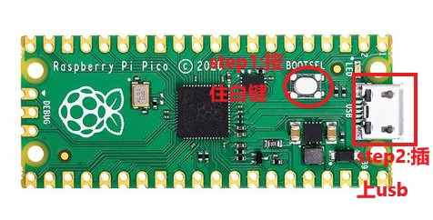

<H1>Quantizer量化器 用户手册</H1>

软件版本 v1.00 文档更新日期 2025-12-01

## 一、快速入门

Quantizer是一款基于触摸控制的模块化合成器量化器，包含三种工作模式：

**量化模式** - 将CV输入信号量化到你选择的音阶上，输出精确的音高

**滑动模式** - 通过触摸位置控制连续变化的CV输出，支持录制和回放触摸轨迹

**琶音模式** - 触摸选择音符，外部时钟触发琶音播放，触摸力度控制八度

模块顶部的12个触摸pad对应12个半音（C到B），通过触摸可以切换每个音符的启用状态。

## 二、模块操作与接口详解

### 1. 模式切换按钮

每次按下该按钮，模块会循环切换三种工作模式：

量化模式 → 滑动模式 → 琶音模式 → 量化模式

### 2. CV输入接口

用于接收控制电压输入（0-10V），在量化模式和琶音模式下作为输入信号，在滑动模式下可用于复位回放。

### 3. 音高输出接口

输出量化后的音高信号（0-10V），遵循1V/oct标准，可直接连接到振荡器或其他模块的音高输入。

### 4. 调谐旋钮

用于微调输出音高，顺时针旋转升高音高，逆时针旋转降低音高。在量化模式和琶音模式下有效。

### 5. 触摸pad区域

12个触摸pad对应12个半音（从左到右：C, C#, D, D#, E, F, F#, G, G#, A, A#, B），不同模式下有不同的作用：

- **量化模式**：触摸切换对应音符的启用/禁用状态
- **滑动模式**：触摸位置决定输出CV值，支持滑动操作
- **琶音模式**：触摸选择音符，触摸力度决定播放的八度

### 6. LED指示灯

12个LED指示灯位于触摸pad上方，显示当前状态：

- **量化模式**：亮起的LED表示该音符已启用，会参与量化计算
- **滑动模式**：单个LED跟随触摸位置移动
- **琶音模式**：亮起的LED表示当前被按下的音符

## 三、各功能模式详解

### 1. 量化模式

**该模式将外部CV输入信号量化到你选择的音阶上，输出最接近的音符**

#### 基本操作

触摸12个触摸pad来切换对应音符的启用状态：
- 触摸一次：启用该音符（LED亮起）
- 再次触摸：禁用该音符（LED熄灭）

模块默认启用自然大调音阶（C, D, E, F, G, A, B），你可以自由组合任意音符来创建自定义音阶。

#### 工作原理

CV输入信号进入模块后，会被自动匹配到当前启用音符中最接近的一个，然后输出对应的音高。例如：
- 如果只启用C、E、G三个音符，无论输入什么CV值，输出只会是这三个音之一
- 如果启用所有12个音符，则输出与输入完全一致（无量化效果）

#### 调谐功能

使用调谐旋钮可以微调输出音高，用于补偿外部设备的音高偏差。

#### 应用场景

- 将LFO或随机信号转换为旋律
- 限制音高在特定音阶内，确保音乐性
- 创建和弦进行，只输出和弦内的音符

### 2. 滑动模式

**该模式通过触摸位置控制连续变化的CV输出，支持录制和回放触摸轨迹**

#### 基本操作

触摸并滑动12个触摸pad，模块会根据触摸位置输出对应的CV值：
- 触摸最左边的pad：输出最低电压
- 触摸最右边的pad：输出最高电压
- 触摸多个pad：根据触摸力度计算加权平均位置

LED指示灯会跟随触摸位置移动，提供视觉反馈。

#### CV录制功能

模块内置录制功能，可以记录你的触摸轨迹：

**录制**
- 当检测到触摸时，自动开始录制CV变化
- 持续录制最长30秒的触摸轨迹

**回放**
- 抬手后等待约300毫秒，自动进入回放模式
- 循环播放之前录制的CV变化曲线
- 如果抬手后很快又触摸，则继续录制

**复位回放**
- 在回放模式下，通过CV输入接口输入一个上升信号，可以将播放头复位到开头

#### 平滑效果

触摸滑动时，输出会自动进行平滑处理：
- 快速滑动：响应迅速，跟手感强
- 慢速滑动：极致平滑，无抖动

#### 应用场景

- 实时控制滤波器截止频率
- 创建动态的调制包络
- 录制并循环播放自动化参数变化

### 3. 琶音模式

**该模式通过触摸选择音符，外部时钟触发琶音播放，触摸力度控制八度**

#### 基本操作

**选择音符**
- 触摸12个触摸pad来选择琶音中包含的音符
- 可以同时触摸多个pad来创建和弦琶音

**力度控制八度**
- 触摸力度越大，播放的八度越高
- 力度最小时播放最低八度（C0）
- 力度最大时播放最高八度（C9）

**时钟触发**
- 通过CV输入接口输入时钟信号（上升沿触发）
- 每个时钟脉冲播放下一个选中的音符
- 所有选中音符播放完毕后，从头循环

**最后音符保持**
- 当所有pad都松开后，模块会继续播放最后一个抬起的音符
- 直到接收到新的时钟信号或重新触摸pad

#### 应用场景

- 创建动态的琶音旋律
- 通过力度变化增加旋律层次
- 配合外部音序器创建复杂的和弦进行

## 四、技术指标

### 1. 尺寸信息

| 项目         | 规格参数          |
|--------------|-------------------|
| 外形尺寸     | 128.5mm x 40.64mm |
| Eurorack宽度 | 8HP               |
| 深度         | 约24mm            |

### 2. 运行信息

| 项目         | 规格参数                          |
|--------------|-----------------------------------|
| 电源接口     | 10pin电源插头                      |
| 保护电路     | 含有防反接电路                     |
| +12V电流需求 | 100ma                             |
| -12V电流需求 | 10ma                              |
| 运行平台     | Pico RP2040                       |

注意事项： USB接口上电可开机，但无法正常输出Eurorack标准电平，也无法接收CV输入！需要接上模块电源才可以输入输出正常电压!

### 3. 电压输出技术指标

| 项目         | 规格参数          |
|--------------|-------------------|
| 采样率       | 8khz              |
| 分辨率       | 12bit             |
| 输出电平范围 | 0-10V             |

### 4. 控制电压输入技术指标

| 项目         | 规格参数          |
|--------------|-------------------|
| 采样率       | 8khz              |
| 分辨率       | 12bit             |
| 输入电平范围 | 0-10V             |

### 5. 触摸控制技术指标

| 项目         | 规格参数          |
|--------------|-------------------|
| 触摸通道数   | 12路              |
| 力度检测     | 支持              |
| 采样频率     | 2kHz              |

## 五、固件升级

<figure>

    <figcaption>固件升级步骤：按住Boot键，插入USB</figcaption>
</figure>

你可以访问 https://environscape.github.io/CodingInspire/support.html 了解最新固件信息

请在usb连接你的计算机之前按住Pico RP2040的Boot键，然后连接usb与计算机，此时你会在你的计算机中发现一个新的磁盘，此时将下载好的UF2固件文件拖入其中，等待一分钟后，直接移除usb，你的Quantizer模块就已经升级完成